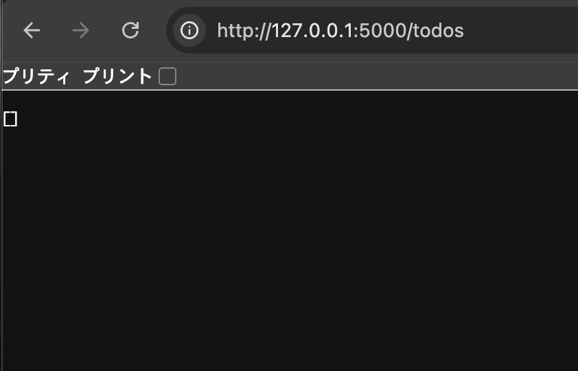
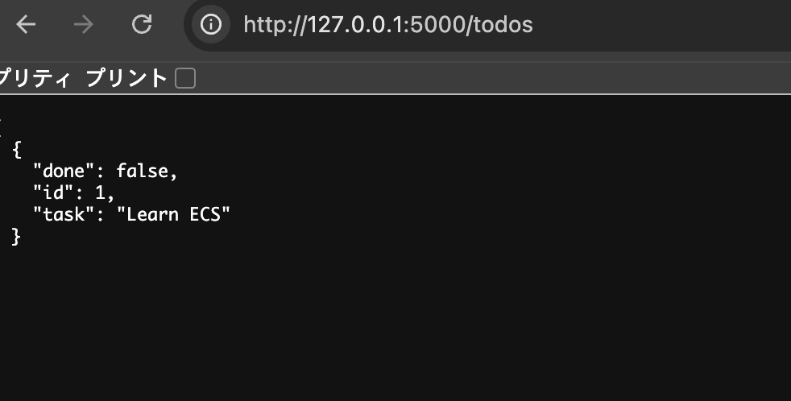
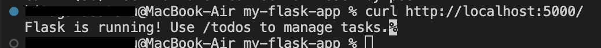
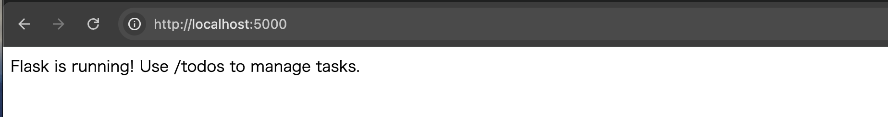
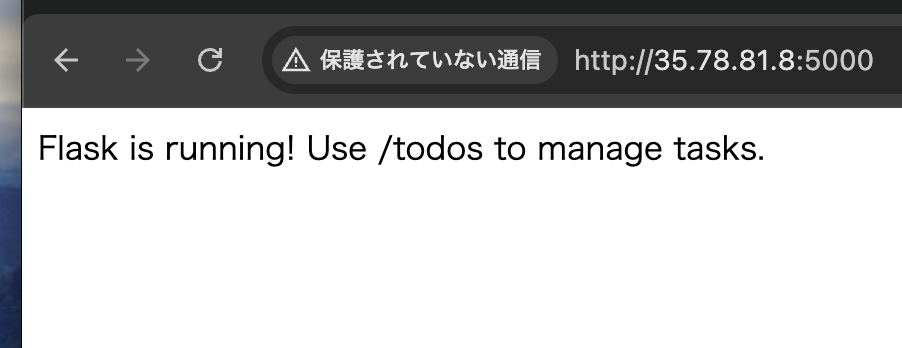
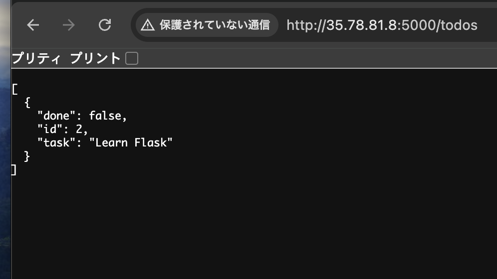

# 学習内容  
AWS ECRとECSを利用したアプリケーションデプロイ  

# 実行環境  
* 開発環境:Macbook Docker AWS CLI  
* デプロイするアプリケーション:Flaskで構築  
* AWSで作成するリソース:RDS VPC サブネット  
* ECS実行環境:EC2インスタンス  
  
## 実行手順  
1. TODOアプリケーションの作成（ローカル環境）  
PythonでシンプルなTODOアプリを作成し、ローカル環境での動作を確認します。  
* TODOアプリケーションコード:[TODOアプリ](TODOsub.py)  
* 実行結果:  
  -   
  -   
  
2. dockerイメージの作成とコンテナ起動  
作成したTODOアプリケーションをDocker化し、コンテナとして起動します。  
* dockerfile:[my-flask-app](my-flask-app)  
  
実行コマンド  
```
docker build -t my-flask-app .  
docker run -p 5000:5000 my-flask-app  
curl https://localhost:5000/
```  
  
実行結果  
  
  
  
  
3. TODOアプリケーションのAWS環境対応とECRへのプッシュ  
SQLiteをRDS for MySQLに変更し、AWS環境に対応したDockerイメージを作成後、ECRへプッシュします。    
  
* AWS対応版アプリケーションコード:[aws-flask-app](aws-flask-app)  
  
ECRへのプッシュ手順  
  - Dockerイメージ作成  
    ```docker build -t aws-flask-app .```  
  - ECRリポジトリを作成  
    ```aws ecr create-repository --repository-name aws-flask-app```  
  - ECRにログイン  
    ```aws ecr get-login-password --region ap-northeast-1 | docker login --username AWS --password-stdin 'repositoryUrl'```  
  - イメージをタグ付け  
    ```docker tag aws-flask-app:latest 'repositoryUrl':latest```  
  - ECRにpush  
    ```docker push 'repositoryUrl:latest```  
  
4. ECSの準備  
ECSを利用して、アプリケーションをデプロイするための環境を構築します。  
* ECSの主要な概念  
  * クラスター：コンテナを配置する実行基盤の集合  
  * インスタンス：クラスターの内でコンテナを実行するEC2インスタンスまたはFargate  
  * タスク：実行するコンテナアプリケーションの定義  
  * サービス：タスクの数や配置ルールを管理するもの  
  
* ECSクラスター作成  
今回は起動タイプをEC2で作成します。  
>[!NOTE]
>セキュリティグループの設定に注意（詳細は後述のエラーセクションを参照）  
>IAMロールにAmazonEC2ContainerServiceforEC2Roleを含む必要なポリシーを設定  
  
* タスク定義の作成  
Flaskアプリケーションのため、ポートマッピングに'5000'を使用  
  
* サービスの作成  
作成したタスク定義に基づいてサービスを作成  
  
5. EC2パブリックIPを使用したアクセス確認  
デプロイされたアプリケーションにEC2のパブリックIPアドレス経由でアクセスし、動作を確認  
  
* EC2パブリックIP:5000へアクセス:
  * 表示内容:`Flask is running! Use /todos to manage tasks.`  
  *   
  
* EC2パブリックIP:5000/todosへアクセス  
  * TODOアプリケーションが起動  
  *   
  
## docker主要コマンド  
* イメージ作成  
```docker build -t イメージ名 .```  
    - `-t`はタグ付け
    - `.`は現在のディレクトリをビルド対象  
* コンテナの起動  
```docker run -p ホスト側:コンテナ側 イメージ名```
    - `-p`はポートのマッピング  
* すべてのコンテナを表示  
```docker ps -a```  
* ローカルに保存されているdockerイメージの一覧  
```docker images```  
* コンテナの停止  
```docker stop コンテナIDor名前```  
* コンテナの削除  
```docker rm コンテナID```  
* イメージの削除  
```docker rmi イメージIDorイメージ名```  
* イメージの取得  
```docker pull イメージ名```  
* イメージをリポジトリにアップロード  
```docker push イメージ名```  
* イメージにタグ付け  
```docker tag 元:タグ 新:タグ```  

## 発生した❗️エラーと解決策  
デプロイ作業中に遭遇したエラーと、その原因および解決策をまとめます。  

* エラー１:`docker run`実行後の`curl: (56) Recv failure: Connection reset by peer`  

**現象**  
`docker run`コマンド実行後、`curl`でアクセスすると`curl: (56) Recv failure: Connection reset by peer`エラーが発生し、Flaskは起動しているように見えるがアクセスが切断される。      
  
**原因**  
Flaskアプリケーションの`host`設定が`127.0.0.1`になっているため  
  
- 127.0.0.1はループバックアドレスというコンピュータ自身を指す特別なIPアドレス  
- Docker環境では、Dockerコンテナ内からは接続できるが外部（ホストマシン）からは接続不可  
- 詳しくは[Dockerコンテナに127.0.0.1でアクセス不可の場合の解消方法](https://qiita.com/taichikanaya_1989/items/5f60b55e847a33f8db41)を参照  
  
**解決方法**　　
Pythonアプリケーション内でFlaskの`host`を"0.0.0.0"に指定  
  
```
if __name__ == "__main__":
app.run(host="0.0.0.0", port=5000, debug=True)
```  
  
* エラー２:ECSクラスターにEC2インスタンスが表示されない  
  
**現象**  
EC2にECSインスタンスが作成されているにも関わらず、ECSクラスターのインフラストラクチャに該当のEC2が表示されない  
  
**原因**  
EC2のセキュリティグループにHTTPS:443ポートを許可していなかったことが原因  
ECSエージェントがAWSのECS APIと通信するのにHTTPS(443)が必要    
  
事前に以下の項目も確認したが問題なかった  
  
* SSH接続を行い`sudo systemctl status ecs`の結果`active`が表示
  - EC2内のecs-agentが動いていることを確認  
* /etc/ecs/ecs.configにECS_CLUSTER=<クラスター名>を確認した結果問題なし
  - ECSエージェントが接続するクラスター名が間違っていないことを確認  
* IAMロールに必要なポリシーが設定されているかを確認した結果問題なし
  - AmazonEC2ContainerServiceforEC2Roleポリシーが付与されていることを確認  
  
**解決方法**  
EC2のセキュリティグループにHTTPS（443）を許可するルールを追加  
なお、SSH(22)やFlask(5000)も併せて許可に設定  

* エラー３:```CannotPullContainerError: no matching manifest for linux/amd64 in the manifest list entries```  
  
**現象**   
 ECSがECRからイメージをプル使用とした際に、上記のエラーメッセージが表示され、自身のアーキテクチャと一致するDockerイメージが存在しないと報告される。  
  
**内容**  
ECSのコンテナインスタンスのアーキテクチャに対して、ECRにプッシュされたDockerイメージのアーキテクチャが一致しないために発生  
  
**原因**  
ECRにプッシュしていた`aws-flask-app`のイメージが、EC2インスタンスのアーキテクチャ（amd64）とは異なるアーキテクチャ（arma64）でビルドされていたため。  
使用しているPCがMac（M1チップ搭載）であり、特に指定しない限りarm64のイメージがビルドされることが原因    
  
**解決方法**  
amd64のアーキテクチャになるように、Dockerイメージをビルドする  
```docker buildx build --platform linux/amd64 -t タグ .```  
  
* エラー４:ECSタスクが起動できず、サービスがロールバックされる（メモリ不足）  
  
**現象**  
ECSでタスクが起動できず、サービスがロールバックされる  
  
エラーメッセージ:  
```service was unable to place a task because no container instance met all of its requirements. The closest matching container-instance [...] has insufficient memory available.```  
  
**内容**  
ECSタスクが要求するメモリサイズが、EC2インスタンスで確保できるメモリ量よりも大きいため、タスクを配置できない状態  
  
**原因**  
* タスクレベルとコンテナレベルのメモリ設定の不整合:  
  * タスクレベル:ECSがインスタンス上にタスクを配置するために必要な容量  
  * コンテナレベル:各コンテナの最小/最大メモリ使用量制限  
* 具体的なエラー原因  
  * タスクサイズ(0.5GB)よりも、コンテナ内で設定したmemory(1GB)の方が大きい  
  * EC2インスタンスの空きメモリ(t2micro=1.0GB)よりもタスクが要求するメモリが大きい  
  
**解決方法**  
タスクサイズ(0.25GB)よりも、コンテナ内で設定したmemory(0.25GB)を小さくする  
EC2インスタンスの空きメモリ(t2micro=1.0GB)よりもタスクが要求するメモリ(0.25GB)を小さくする  