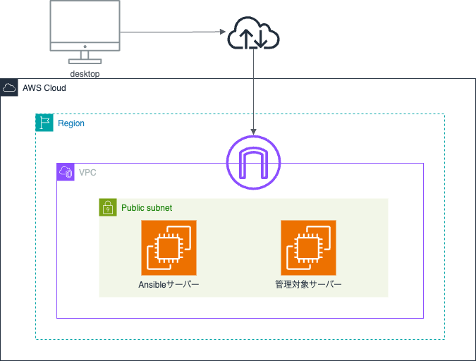

# 学習内容  
Ansibleの使い方  

# Ansibleとは  
構成管理ツールである。ChefやPuppetと違いエージェントが不要なため、モジュールを導入する必要がなく、準備の手間を省ける。  
Ansibleはplaybookという環境設定の定義を記載したYAMLファイルがあれば実行できる。  
Ansibleがインストールされたサーバーと管理対象のサーバーがあればいい。

# テスト実行    
## AWS環境  

  

## 目的  
今回はAnsibleの利用が初めてなため、「Nginxのインストールと起動」という簡単な内容で試した。  

## 実行手順  
1. **同一VPC内にEC2を２台作成**  

Ansibleサーバー→ansible-server(OS:Amazon Linux2)  
管理対象サーバー→ansible-test(OS:Amazon Linux2)  
  
2. **Ansibleのインストール**  

ansible-serverにAnsibleをインストール  
```
sudo amazon-linux-extras enable ansible2  
sudo yum install -y ansible
```  
インストール確認  
```
ansible --version
```  

3. **ansible-serverからansible-testへssh接続を行う**  

ローカルからansible-serverに秘密鍵を転送する  
```
scp -i my-key.pem my-key.pem ec2-user@ansible-serverのパブリックIP:/home/ec2-user/  
my-key.pem → 秘密鍵
```  

ansible-serverにSSHでログインし、秘密鍵の権限を設定する  
```
chmod 400 my-key.pem
```  

4. **ansible-serverからansible-testにSSH接続を確認**  

ansible-serverにSSHでログインし、ansible-testにSSH接続を行う  
>[!WARNING]
>セキュリティ上、ansible-testのプライベートIPを使用してSSH接続を行う  
```
ssh -i my-key.pem ec2-user@ansible-testプライベートIP
```  
>[!NOTE]
>ansible-testのセキュリティグループにansible-serverからのSSH(ポート22)を許可する  

5. **管理対象のansible-testをAnsibleに登録**  

>[!NOTE]
>インベントリファイルとはAnsibleが管理する対象サーバー(インベントリ)を定義するファイル  

ansible-serverの/etc/ansible/hostsを編集  
ただし、/etc/ansible/hostsはデフォルトのインベントリファイルであり、別に任意のインベントリファイルでを作成し、
コマンド実行時に自分で作成したインベントリファイルを指定してもOK  
今回はtest-ansibleというディレクトリを作成  
```
mkdir test-ansible  
cd test-ansible  
```  
hostsというインベントリファイルを作成しansible-testを登録
```
vim hosts  
[web_server]  
ansible-test ansible_host=ansible-testのプライベートIP ansible_user=ec2-user ansible_ssh_private_key_file=/home/ec2-user/my-key.pem
```  
* [web_server]→[グループ名]管理対象のサーバーをまとめるグループ名  
* ansible_host=<IPアドレス>→接続先のサーバーIP  
* ansible_user=ec2-user→EC2のデフォルトユーザー  
* ansible_ssh_private_key_file=<鍵のパス>→SSH接続用の秘密鍵  

6. **Ansibleの接続テスト**  

Ansibleが正常に動くかを確認  
```
ansible all -m ping -i /home/ec2-user/test-ansible/hosts
```  
SUCCESSが出ればOK  

7. **ロールの作成**  

test-ansible配下にrolesディレクトリを作成  
roles配下にansible-galaxyコマンドでAnsibleのロールを作成  
/home/ec2-user/test-ansible/roles/myrole/~  
myrole→ロール名を指定する  
今回はロール名をNginxとすべきところを、誤ってmyroleで作成してしまった  
```
mkdir roles  
ansible-galaxy init myrole
```  
>[!NOTE]
>ansible-galaxy init myrokeコマンドはAnsibleのロールを作成できるコマンド
>ロールを使うと、設定を整理しやすくなり、再利用もしやすくなる
>自動的に各種設定ファイルが作成される  

ansible-galaxy init myroleコマンドにより以下の構成が出来上がった  
```
test-ansible
├── hosts
├── roles
│   └── myrole
│       ├── README.md
│       ├── defaults
│       │   └── main.yml
│       ├── files
│       ├── handlers
│       │   └── main.yml
│       ├── meta
│       │   └── main.yml
│       ├── tasks
│       │   └── main.yml
│       ├── templates
│       ├── tests
│       │   ├── inventory
│       │   └── test.yml
│       └── vars
│           └── main.yml
└── site.yml
```  

8. **Playbookの作成**  

myrole/tasks/main.ymlにNginxをインストールと起動するロールを記載  
```
# tasks file for myrole  
- name: Update all packages  
  yum:  
    name: '*'  
    state: latest  

- name: Enable Nginx on Amazon Linux2  
  command: amazon-linux-extras enable nginx1  
  args:  
    creates: /etc/yum.repos.d/amzn2-extras.repo  
  
- name: Install Nginx  
  yum:  
    name: nginx  
    state: present  
  
- name: Start Nginx  
  service:  
    name: nginx  
    state: started  
    enabled: yes
```  

playbookとしてtest-ansible配下にsite.ymlを作成  
site.ymlにロールを適用する  
```
vim test-ansible/site.yml  
  
- name: Apply Nginx Role  
  hosts: web_server  
  become: yes  
  roles:  
    - myrole
```  

9. **Playbookの実行**  

```
ansible-playbook -i hosts site.yml
```  

10. **Nginxの起動確認**  

ansible-testのプライベートIPを使って接続確認を行う  

方法①  ansible-testにログインして、Nginxが動いているかを確認  
```
sudo systemctl status nginx
```  
方法②　ansible-testにログインして、curlでアクセス確認  
```
curl http://プライベートIP
```  
方法③　ansible-serverからansible-testにcurlでアクセス確認  
```
curl http://ansible-testのプライベートIP
```  
>[!WARNING]
>ansible-testのセキュリティグループがansible-serverからのHTTP(ポート80)を許可する

# 所感
今回はNginxのみという単純な構成でのテストであったが、もっと複雑な構成を自動で作成でき、またPlaybookを一度作りさえすれば何個でも同じ構成を作成できるという点は非常に魅力を感じた。また、Ansibleにおいては、確かに理解がしやすく、完全初心者な私でも利用できたという点からも使いやすさを感じた。

