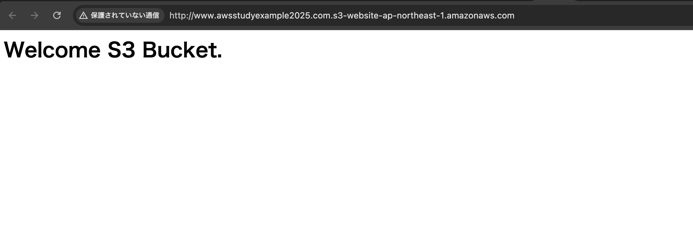

# 学習内容  
1. 単純なWebサーバーの作成  
   S3を使ったWebサーバーを作成し、ElasticIPとRoute53を使ってドメイン名でアクセスできるようにする。  
2. ブログサーバーの作成  
   EC2を使いWordPressをインストールしブログを使えるようにする。  
   記事はデータベースに保存するためRDSを使い、暗号化と高負荷に耐えるようCloudfrontとELTを使う。  

# 学習報告  
## 第一章  
--内容--  
S3の静的ウェブサイトホスティング機能を使いWebサーバーを構築する  
  
--詳細--  
1. S3バケットを作成する  
独自ドメインでアクセスするため、S3バケット名をwww.awsstudyexample2025.comとする  
Webサーバーとして使うため、ブロックパブリックアクセス設定を無効にする  

2. 静的ウェブサイトホスティング機能を有効にする  
作成したS3バケットのプロパティから静的ウェブサイトホスティング機能を編集し有効にする  
インデックスドキュメント:index.html  
   - 「/」で終わるURLを指定したときに返すファイル  

エラードキュメント:error.html  
   - エラーが発生したときに返すページを構成するファイル  

リダイレクトルール:空欄  

3. バケットポリシーの設定  
誰でも読み取りが可能になるようにバケットポリシーを設定する  
[バケットポリシー参考URL](https://docs.aws.amazon.com/ja_jp/AmazonS3/latest/userguide/WebsiteAccessPermissionsReqd.html)  
```
{
    "Version": "2012-10-17",
    "Statement": [
        {
            "Sid": "PublicReadGetObject",
            "Effect": "Allow",
            "Principal": "*",
            "Action": "s3:GetObject",
            "Resource": "arn:aws:s3:::www.awsstudyexample2025.com/*"
        }
    ]
}
```  

4. ファイルをアップロードする  
インデックスドキュメント「index.html」のファイルをS3にアップロードする  
index.htmlには「Welcome S3 Bucket.」と表示される内容を記載  
```index.html
<html>
<body>
<h1>Welcome S3 Bucket.</h1>
</body>
</html>
```  

5. エンドポイントでアクセス  
ブラウザからエンドポイントでアクセス  
  

## 第二章  
--内容--  
WordPressを動かすためのWebサーバーをEC2で構築する  
  
--詳細--  
1. EC2を作成する  
   - Amazon Linux2023 t2micro  
   - 開放セキュリティグループ:ssh http https  

2. Nginxのインストール  
   - ```sudo dnf install nginx```  
   - ```sudo systemctl start nginx```  
   - ブラウザで確認→Welcome to nginx!  

3. PHPのインストール  
   - ```sudo dnf install php```  
   - ```sudo dnf install php-mysqli php-mbstring php-gd```  

4. 
